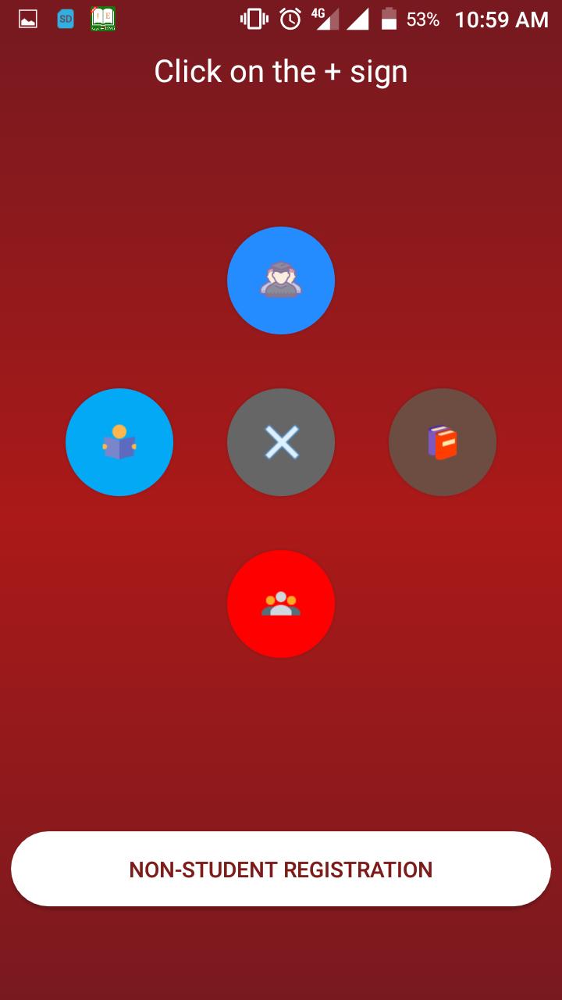

# KNUST-Virtual-Library (KVL) - ANDROID

## About
This application is being developed by a group of third year computer engineering students from knust as their software development project.
It hopes to provide a sort of virtual library implementation with advanced features to ease mobile learning.
[Continue Reading :blush:](https://github.com/Unitechglobal/KNUST-Virtual-Library-KVL-ANDROID/blob/master/Software%20Specifications.md).

## Interface as of now 
 

 

## Download links
Still working on this. Check back later. :wink:

## Issues and Suggesions
We are open and ready to work on all issues and recommendations. All contributions are appreciated :thumbsup:
Post all issues and or suggestions [here](https://github.com/Unitechglobal/KNUST-Virtual-Library-KVL-ANDROID/issues).
You can also help with our survey by filling [this google form](https://goo.gl/N2P1qu). *recommended*

